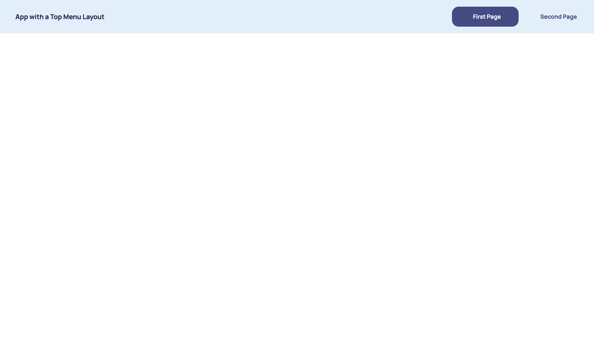

The pre-built templates cover a lot of situations however you may wish to structure your app differently.

## Building Your Own Template

Templates can be added via the `add_template_renderer` method on your `dara.core.configuration.ConfigurationBuilder`.

The `TemplateBuilder` class is provided to configure a custom template and it has two main properties:

- `name`: The name of the template, so it can be set for the application.
- `layout`: The layout of the template. This should be constructed from standard Dara components.

You will also need to construct a router for your different pages which is easily done with the `dara.core.visual.template.TemplateBuilder`'s helper method - `add_router_from_pages`.

The `layout` will require a `dara.core.visual.components.RouterContent` component. The `RouterContent` component takes the router's content objects from the API and creates a react-router based on them.

This covers how to add the the necessary template renderer but you must tell your app which renderer you want to use by setting `config.template` as there are still the pre-built options of `blank` and `default`. This also allows you to play with different renderers and see how they look on your screen simply by setting the `config.template` attribute to the one you want to use.

For context, the example below replicates the pre-built `blank` template.

```python
from dara.core import ConfigurationBuilder
from dara.core.definitions import Configuration
from dara.core.visual.components import RouterContent
from dara.core.visual.template import TemplateBuilder

# Create a configuration builder
config = ConfigurationBuilder()

def template_renderer(config: Configuration):
    builder = TemplateBuilder(name='blank')

    # Using the TemplateBuilder's helper method - add_router_from_pages
    # to construct a router of page definitions
    router = builder.add_router_from_pages(list(config.pages.values()))

    # Adding the RouterContent to the layout
    builder.layout = RouterContent(routes=router.content)

    return builder.to_template()

config.add_template_renderer('blank', template_renderer)

config.template = 'blank'
```

The example below creates a simple top-bar style layout using the `dara-components` and the `dara.core.visual.components.Menu` component.

```python
from dara.core import ConfigurationBuilder
from dara.core.definitions import Configuration
from dara.core.visual.components import RouterContent, Menu
from dara.core.visual.template import TemplateBuilder
from dara.components import Stack, Text

# Create a configuration builder
config = ConfigurationBuilder()

def template_renderer(config: Configuration):
    builder = TemplateBuilder(name='top-bar')

    # Using the TemplateBuilder's helper method - add_router_from_pages
    # to construct a router of page definitions
    router = builder.add_router_from_pages(list(config.pages.values()))

    builder.layout = Stack(
        Stack(
            Text('Top Layout', color='white'),
            # Adding the Menu component, forcing it to be horizontal and justify it to the right
            Stack(
                Menu(routes=router.links),
                direction='horizontal',
                justify='right'
            ),
            background='rgb(26, 35, 49)',
            direction='horizontal',
            height=60,
            scale_equal=True
        ),
        RouterContent(routes=router.content)
    )

    return builder.to_template()

config.add_template_renderer('top-bar', template_renderer)

config.template = 'top-bar'
```

Notice the difference between the layouts from the first example and the second example. Both have the `RouterContent` component but the second example adds more components to construct a horizontal menu at the top of the screen with links to each page. In the first example, the pages will be shown in the body of the RouterContent component, but you won't have any way to switch between them, except for changing the url directly.

:::tip
How does it work under the hood? The `template_renderer` function is called on application startup. As you can see it is called with the full application config so that you can extract any information you need from there. The examples above extract the pages from the config but you can also extract other properties if needed.
:::

Below is an example of putting it all together.

```python python title=main.py
from dara.core import ConfigurationBuilder
from dara.core.definitions import Configuration
from dara.core.visual.components import RouterContent, Menu
from dara.core.visual.template import TemplateBuilder
from dara.components import Text, Spacer, Stack
from dara.core.visual.themes import Light

# Create a configuration builder
config = ConfigurationBuilder()


# Register pages
config.add_page('First Page', Stack())
config.add_page('Second Page', Stack())


def template_renderer(config: Configuration):
    builder = TemplateBuilder(name='top-bar')

    # Using the TemplateBuilder's helper method - add_router_from_pages
    # to construct a router of page definitions
    router = builder.add_router_from_pages(list(config.pages.values()))

    builder.layout = Stack(
        Stack(
            Spacer(size='1rem'),
            Text('App with a Top Menu Layout', bold=True),
            # Adding the Menu component, forcing it to be horizontal and justify it to the right
            Stack(Menu(routes=router.links), direction='horizontal', justify='right'),
            background=Light.colors.blue3,
            direction='horizontal',
            scale_equal=True,
            padding='1rem',
        ),
        RouterContent(routes=router.content),
    )

    return builder.to_template()


config.add_template_renderer('top-bar', template_renderer)

config.template = 'top-bar'
```

If this template is applied to your application then you end up with the following view:



:::tip
You can always save your `template_render` function in another file and import it to `main.py` to keep your configuration building clean. Just remember to make sure it has a `config` argument so it can get the information it needs from there.
:::

## Pre-built frames

`Dara` provides two pre-built frame components that can be used to quickly construct a custom layout:

- `dara.core.visual.components.sidebar_frame.SidebarFrame`
- `dara.core.visual.components.topbar_frame.TopbarFrame`

These are used internally to construct the `default`, `top` and `top-menu` templates. However, you can use them to construct your own custom templates. As an example, you might want to customise the look of your app by using a different logo. To achieve that, put a logo image in the `static` folder alongside a `favicon.ico` file.

```
- static
    - logo.png
    - favicon.ico
- project_name
    - main.py
    - ...
- pyproject.toml
```

:::tip

If an `.ico` file is found in `./static/`, it is used instead of the default `favicon.ico` file.

:::

Then, you can use the `TopbarFrame` or `SidebarFrame` component to construct a custom template.

```python title=main.py
from dara.core import ConfigurationBuilder
from dara.core.definitions import Configuration
from dara.core.visual.components import RouterContent
from dara.core.visual.template import TemplateBuilder
from dara.core.visual.themes import Light
from dara.core.visual.components.sidebar_frame import SidebarFrame

# Create a configuration builder
config = ConfigurationBuilder()

def template_renderer(config: Configuration):
    builder = TemplateBuilder(name='side-bar')

    # Using the TemplateBuilder's helper method - add_router_from_pages
    # to construct a router of page definitions
    router = builder.add_router_from_pages(list(config.pages.values()))

    builder.layout = SideBarFrame(
        content=RouterContent(routes=router.content),
        side_bar=Menu(routes=router.links),
        logo_path='static/logo.png',
    )

    return builder.to_template()

config.add_template_renderer('side-bar', template_renderer)
config.template = 'side-bar'
```

:::info

The `logo_path` must be provided in the format of `static/path_to_image.extension`. See `dara.components.common.image.Image` for more information.

:::
