This page will give you more insight on how to use components.

## Thinking in Components

Any function that returns a component can be thought of as a component and can be used as one. Components can be comprised of a group of components from any of the extensions, or components can be completely self made. The return value of your component should extend the `dara.core.definitions.ComponentInstance` class from Dara's core framework, however you do not need to worry about this if you are building a component with any of the already defined components from any of the extensions as they are all sub-classed from `ComponentInstance`.

When wondering if you have built a component, all you need to ask yourself is does it return a component? If so, the answer is yes. If it returns a `str`, `int`, `float`, or any other type, it is not a component.

This way of thinking allows the Dara framework to be extendable and flexible.

This page will go over some commonly used components that can help you compile your own components and an example to bring the concepts together.

## Commonly Used Components

There are a number of core components, from which you can build your own.

### `Text`

A `dara.components.common.text.Text` component is the basic component for adding text to a page.

```python
from dara.components import Text

Text('My text', align='center')
```

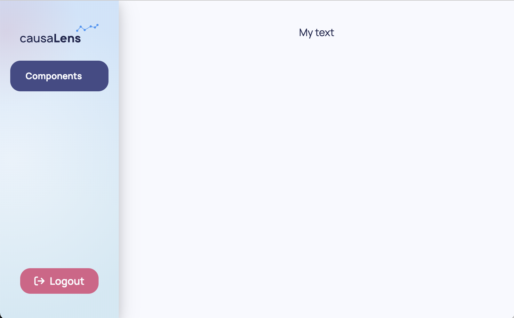

### `Heading`

A `dara.components.common.heading.Heading` component is the basic component for adding any kind of title/sub-title to your document.

```python
from dara.components import Heading

Heading(
     heading='This is the heading text'
)
```

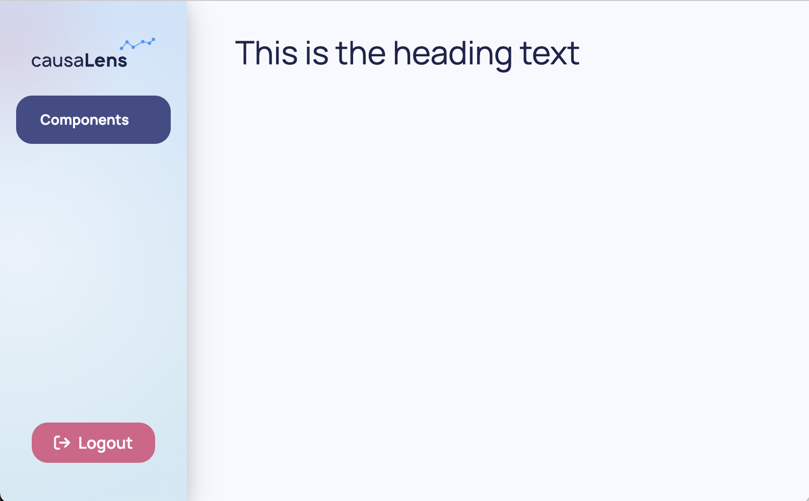

### `Stack`

A `dara.components.common.stack.Stack` component is the core component for laying out a document. By default a stack takes any number of children as arguments and stacks them next to each other either vertically or horizontally, with vertically being the default.

```python
from dara.components import Stack

Stack(
    Text('This text will appear above'),
    Text('this text.')
)

Stack(
    Text('This text will appear next to'),
    Text('this text.'),
    direction='horizontal'
)
```

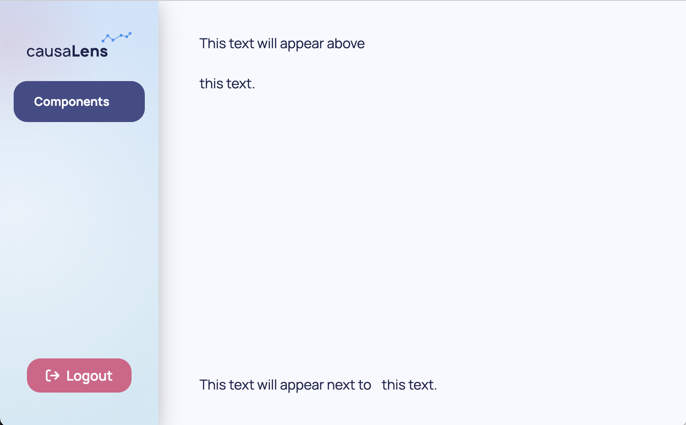

### `Card`

A `dara.components.common.card.Card` wraps a component instance and gives it a title, an optional subtitle, and an optional sidebar.

```python
from dara.components import Card, Stack, Text

Card(
    Text('Content for the card body'),
    title='My First card',
    subtitle='Subtitle for my first card',
)
```

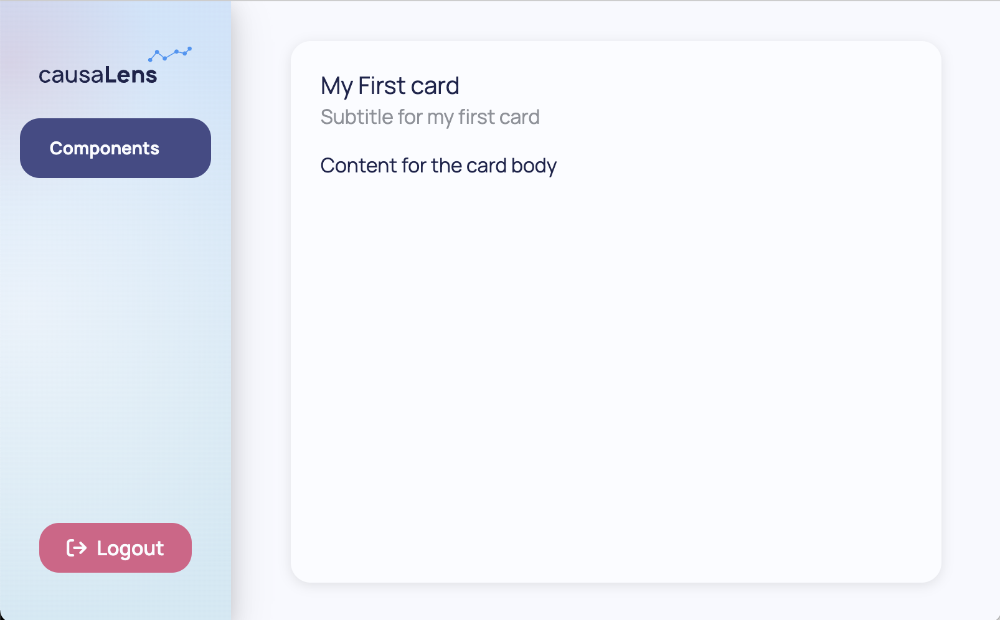

A `Card` can also take an `accent` argument, changing its background its appearance.

```python
from dara.components import Card, Stack, Text

Card(
    Text('Content for the card body'),
    title='My First card',
    subtitle='Subtitle for my first card',
    accent=True,
)
```

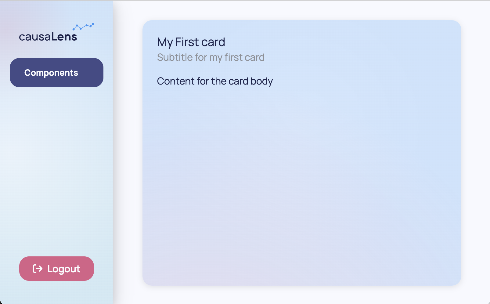

These are just a few examples of simple components. You will come across more complex components later on along with components that enable interactivity with your app.

## Creating Layouts

### `Grid`

`dara.components.common.grid.Grid` provides a 2D Flexbox grid system. The `Grid` layout will wrap cells to fit the available space, allowing for responsive design when the size of the browser is changed.

`Grid`s consists of `Column` and `Row` objects which can contain any kind of other component.
`Grid` works in a twelve columns per row system and you can specify the `span` of a `Column` object to specify how many columns out of the twelve that it should take up.

For the purpose of demonstration, background colors are added to show where one row/column ends and the other begins.

```python
from dara.components import Grid, Text
from dara.core.visual.themes import Light

Grid(
    Grid.Row(
        Grid.Column(
            Text('Row 1 Column 1'),
            background=Light.colors.blue2,
            justify='center',
            span=8
        ),
        Grid.Column(
            Text('Row 1 Column 2'),
            background=Light.colors.blue3,
            justify='center',
            span=4
        ),
        padding='10px'
    ),
    Grid.Row(
        Grid.Column(
            Text('Row 2 Column 1'),
            background=Light.colors.blue2,
            justify='center',
            span=5
        ),
        Grid.Column(
            Text('Row 2 Column 2'),
            background=Light.colors.blue3,
            justify='center',
            span=4
        ),
        Grid.Column(
            Text('Row 2 Column 3'),
            background=Light.colors.blue4,
            justify='center',
            span=3
        ),
        padding='10px'
    ),
)
```


You can specify the space between columns with the `column_gap` argument of the wrapping `Row` object. You can specify the space between rows with the `row_gap` argument of the wrapping `Grid` object.

:::caution
The `span` argument of a _single_ `Column` object should not exceed twelve. If the _sum_ of the `span`s of each `Column` object within a `Row` exceeds twelve then the `Row`'s content will wrap over to the next row. However, it is best practice to keep this sum at or below twelve.
:::

### Nesting Stacks

Note that you can nest `Stack`s within each other to get a similar behavior as a `Grid`. However, `Grid`s are preferred for defining your page's top layout as they allow for more responsive design while `Stack`s can be used to group together smaller bits within your `Grid`.

The following example shows how `Stack`s can be used with the same content to achieve a different layout within a `Grid`. As `Column` objects automatically place its components next to each other horizontally, you can wrap everything in a `Stack` to display it vertically.

For the purpose of demonstration, background colors are added to show where one row/column ends and the other begins.

```python
from dara.components import Input, Grid, Stack, Text
from dara.core.visual.themes import Light

Grid(
    Grid.Row(
        Grid.Column(
            Stack(
                Text('What is your favorite coding language?'),
                Input(value=Variable('Python')),
            ),
            Stack(
                Text('When was your favorite coding language created?'),
                Input(value=Variable('1991')),
            ),
            background=Light.colors.blue3,
            justify='center',
            align_items=True,
            span=8,
            padding='10px',
        ),
        Grid.Column(
            Stack(
                Text('What is your favorite coding language?'),
                Input(value=Variable('Python')),
                Text('When was your favorite coding language created?'),
                Input(value=Variable('1991')),
            ),
            background=Light.colors.blue4,
            justify='center',
            span=4,
            padding='10px',
        ),
        column_gap=2,
    ),
)
```

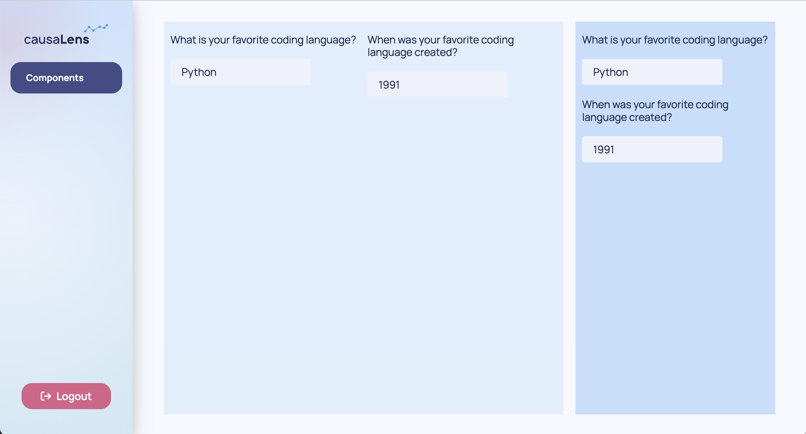

### `Spacer`

While `Stack`s have default paddings, sometimes you need to specify some space. The `dara.components.common.spacer.Spacer` component can be used for this purpose and you can specify how much space with the `size` argument.

For the purpose of demonstration, background colors are added to show where one stack ends and the other begins.

```python
from dara.components import Stack, Spacer, Text
from dara.core.visual.themes import Light

Stack(
    Stack(
        Text('First stack'),
        background=Light.colors.blue3,
    ),
    Spacer(size='25%'),
    Stack(
        Text('Second stack'),
        background=Light.colors.blue4,
    )
)
```

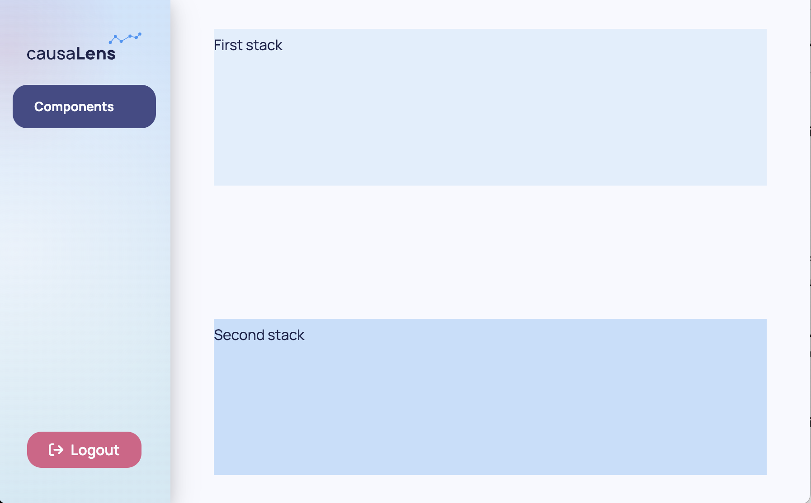

:::caution
If using percentages to define heights and widths, the heights and widths of a `Stack`'s children components do not have to add up to 100%. However, you will get unwanted behavior when the sum of the values _exceed_ 100%.
:::

## Interactive Components

These components are all static, so while their contents can be updated the components themselves are not interactive. Some commonly used interactive components are `dara.components.common.input.Input`s, `dara.components.common.select.Select`s, `dara.components.common.slider.Slider`s, `dara.components.common.switch.Switch`es, `dara.components.common.button.Button`s and `dara.components.common.datepicker.DatePicker`s.

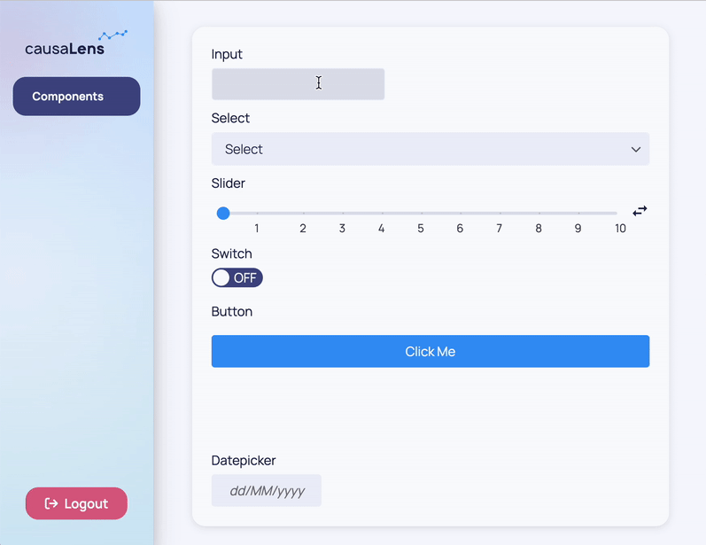

As these components are interactive, they take more inputs than just some string to display. You will learn how to use these components in the [next section](./interactivity.md).

## Putting It All Together

This is your app currently.

```python title=main.py
from dara.core import ConfigurationBuilder
from dara.components import Heading

# Create a configuration builder
config = ConfigurationBuilder()

# Register pages
config.add_page('Hello World', Heading('Hello World!'))
```

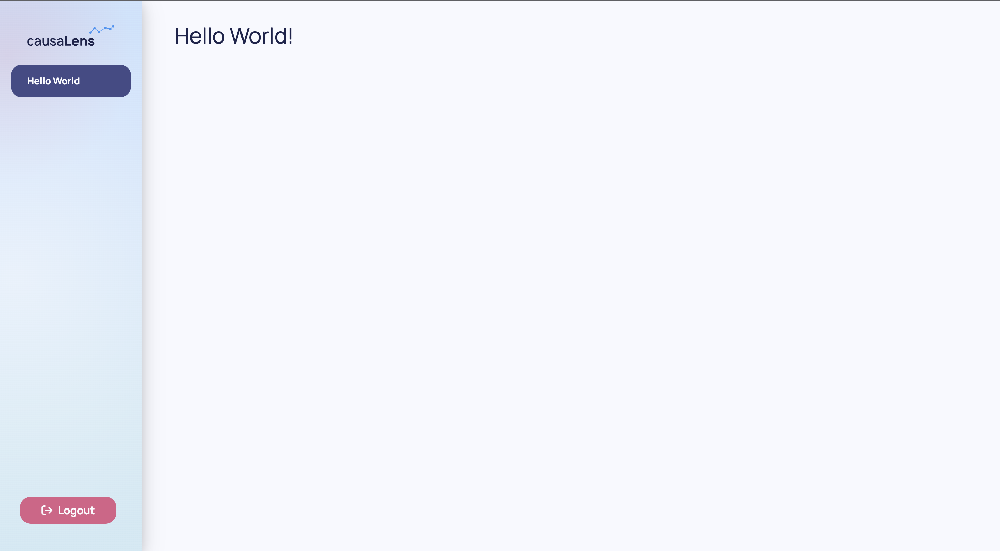

You can make the content of your app slightly more complex with the following:

```python title=main.py
from dara.core import ConfigurationBuilder
from dara.components import Heading, Text, Card

# Create a configuration builder
config = ConfigurationBuilder()

# Register pages
card = Card(
    Text('My new page.'),
    title='My New Page\'s Card'
)

config.add_page('Hello World', Heading('Hello World!'))
config.add_page('My Second Page', Text('Hello World, again.'))
config.add_page('Page with a Card', card)

```


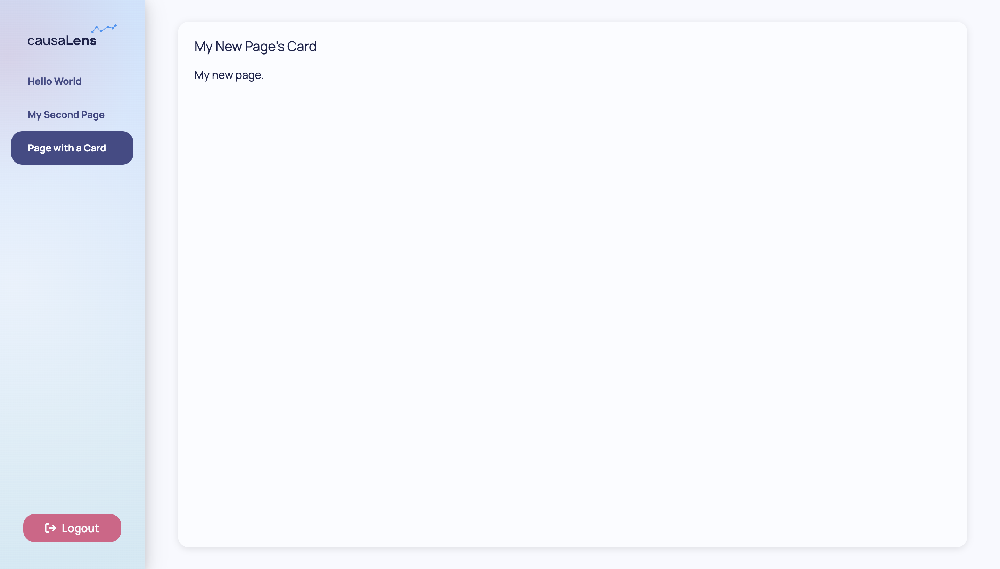

In this case you are statically defining your page however you can also define functions or classes that return components that change with its inputs.

```python
def third_page(title_str: str, content_str: str):
    return Card(
        Text(content_str),
        title=title_str
    )

config.add_page(
    'Page with a Card',
    third_page('My new page', 'My new page, which was defined by a function.')
)
```

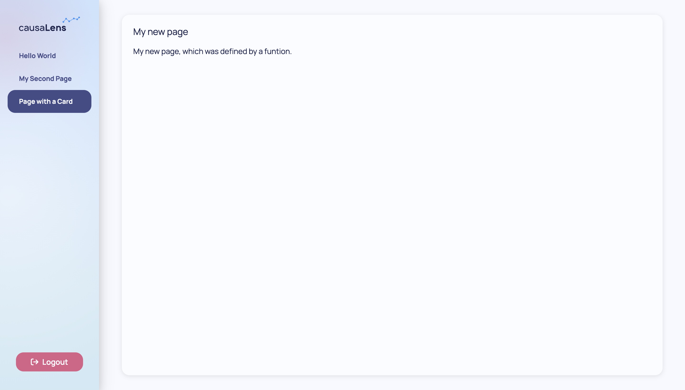

:::tip
As your app gets bigger and more complex, you will want to separate your page logic from your main configuration file. You will also want to make informed decisions on whether to define your components statically, functionally, or in a class.
Check out the section [**Best Practices: Separating Pages**](../best-practices/app-structure-breakdown#separating-pages) to learn more.

Defining components as functions or classes allows you to repeatedly call them with different inputs instead of having to redefine and customize the component again. Check out the section [**Best Practices: Reusing Components**](../best-practices/reusing-components) to learn more.

Finally, you may want to give your reusable components a different look. Check out [**Styling: Customizing Components**](../advanced/styling-components) to learn more.
:::

## Next Steps

Components, either prebuilt or custom-made, are a nice way to display information in your app but everything up until this point has been static. In the next section, you will learn how to make your apps interactive.